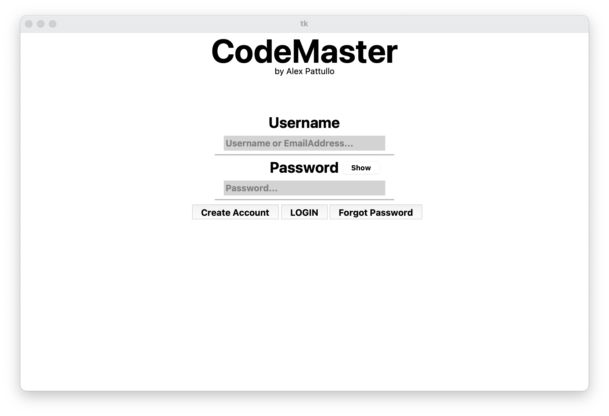
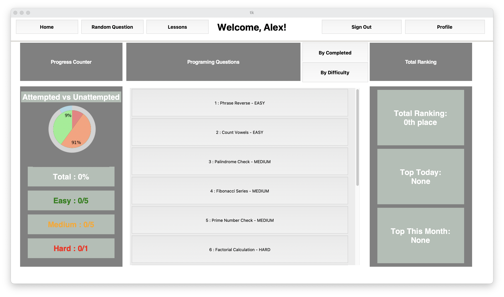
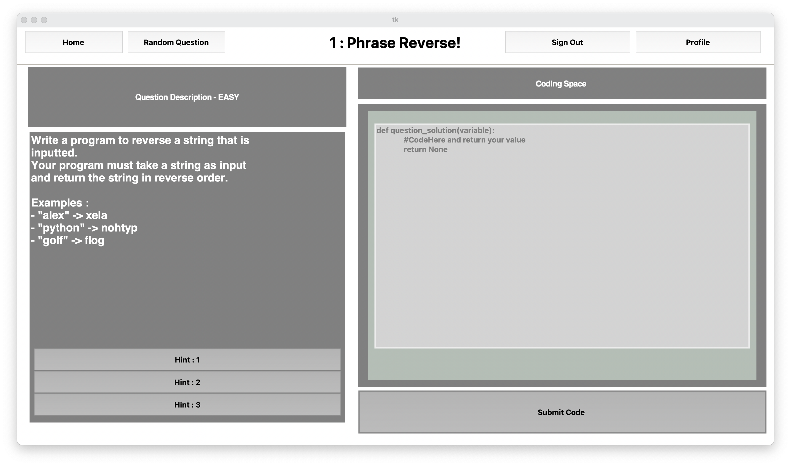
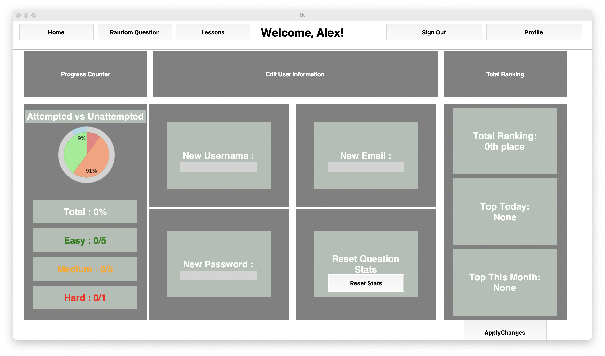
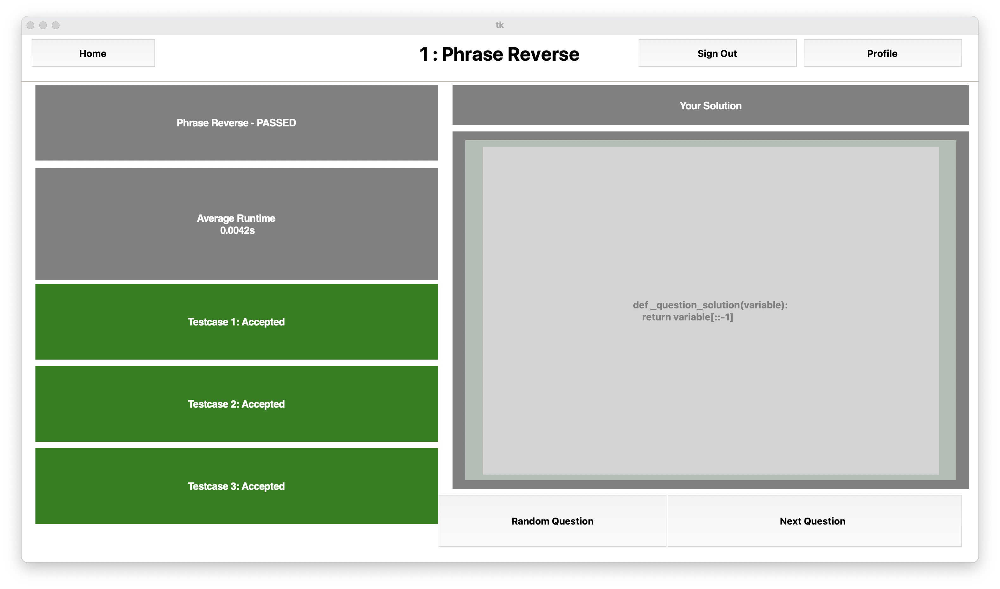
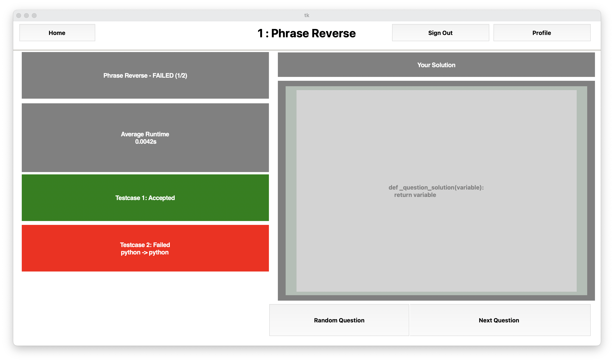

# CodeMaster

CodeMaster is a desktop coding-practice application I designed and built as my A-level Computer Science NEA, for which I achieved an A*. The project was aimed at A-level students who wanted a focused way to practise programming, rather than using platforms designed mainly for technical interviews.

## What I built

The application allows users to:

- Create an account, log in and reset their password
- Practise a set of programming questions with different difficulty levels
- View examples and reveal hints when they get stuck
- Submit a Python solution and have it tested against stored test cases
- See which test cases passed or failed, along with the average runtime
- Save attempts and track progress through statistics and rankings
- Update their profile and review their question history

The project includes 11 questions and 34 test cases, stored and loaded through SQLite.

## Screenshots

These screenshots show the completed application running locally with an isolated user named Alex.













## How the project was developed

I began by interviewing A-level Computer Science students and surveying potential users. I also compared existing platforms such as LeetCode and AlgoExpert. This research influenced the main features, including difficulty levels, hints, progress tracking, random questions and feedback after submitting a solution.

I designed the application using a modular structure. The interface is split into separate pages for authentication, the question list, individual questions, solutions and user profiles. Database classes handle users, questions and attempts, while a separate question marker compiles submitted solutions, runs the test cases and records runtime results.

## Technologies

- Python
- Tkinter
- SQLite
- Matplotlib
- BCrypt

## Running locally

```bash
python -m venv .venv
source .venv/bin/activate
pip install -r requirements.txt
python main.py
```

Run the commands from the project directory. On Windows, activate the environment with `.venv\\Scripts\\activate`.

On first run, the application creates a local SQLite database and loads the questions from `preloadeddata/questions.json`. The database is ignored by Git because it contains local account and attempt data.

## Project status

This is a completed educational prototype from my A-level NEA, rather than a production online code-execution service. Submitted code is executed locally, so the application should only be used with trusted input.
